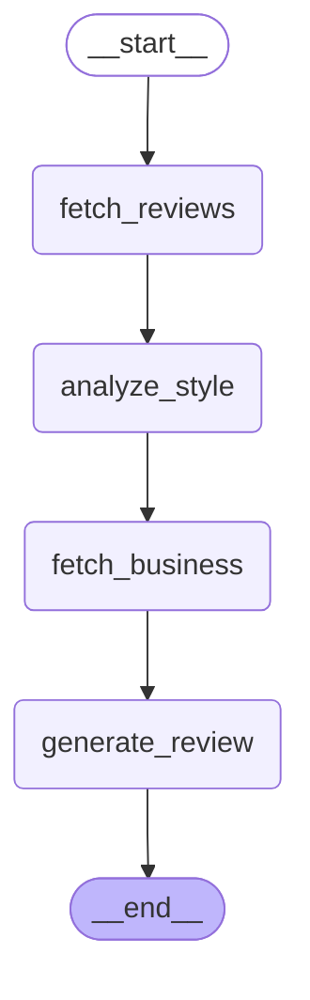
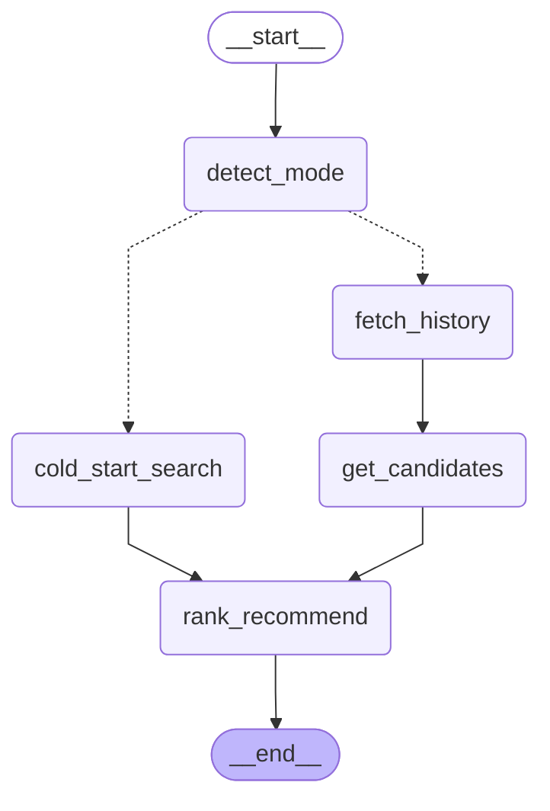

# Agent Flow Diagrams

## Task A Agent - User Modeling

```mermaid
---
config:
  flowchart:
    curve: linear
---
graph TD;
	__start__([<p>__start__</p>]):::first
	fetch_reviews(fetch_reviews)
	analyze_style(analyze_style)
	fetch_business(fetch_business)
	generate_review(generate_review)
	__end__([<p>__end__</p>]):::last
	__start__ --> fetch_reviews;
	analyze_style --> fetch_business;
	fetch_business --> generate_review;
	fetch_reviews --> analyze_style;
	generate_review --> __end__;
	classDef default fill:#f2f0ff,line-height:1.2
	classDef first fill-opacity:0
	classDef last fill:#bfb6fc

```

## Task B Agent - Recommendations

```mermaid
---
config:
  flowchart:
    curve: linear
---
graph TD;
	__start__([<p>__start__</p>]):::first
	detect_mode(detect_mode)
	fetch_history(fetch_history)
	cold_start_search(cold_start_search)
	get_candidates(get_candidates)
	rank_recommend(rank_recommend)
	__end__([<p>__end__</p>]):::last
	__start__ --> detect_mode;
	cold_start_search --> rank_recommend;
	detect_mode -.-> cold_start_search;
	detect_mode -.-> fetch_history;
	fetch_history --> get_candidates;
	get_candidates --> rank_recommend;
	rank_recommend --> __end__;
	classDef default fill:#f2f0ff,line-height:1.2
	classDef first fill-opacity:0
	classDef last fill:#bfb6fc

```
